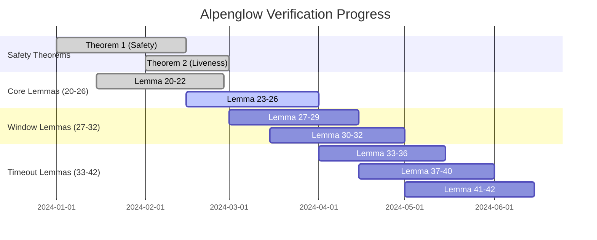

# Alpenglow Verification Status Dashboard

**Last Updated:** `$(date -Iseconds)`  
**Dashboard Version:** 1.0.0  
**Data Source:** Automated verification audit pipeline

---

## 🎯 Executive Summary

| Metric | Value | Status |
|--------|-------|--------|
| **Total Theorems** | 25 |  |
| **Verification Rate** | `${VERIFICATION_SUCCESS_RATE}%` |  |
| **Correspondence Score** | `${CORRESPONDENCE_SCORE}%` |  |
| **Last Audit** | `${LAST_AUDIT_TIME}` |  |

### 🚨 Critical Alerts
```bash
# Auto-generated alerts from verification pipeline
${CRITICAL_ALERTS}
```

---

## 📊 Verification Status Overview

### Main Theorems (2/2)

| Theorem | Whitepaper | TLA+ | Verification | Proof Obligations | Correspondence | Notes |
|---------|------------|------|--------------|-------------------|----------------|-------|
| **Theorem 1 (Safety)** | ✅ Section 2.9 | ✅ `WhitepaperTheorem1` |  | `${THEOREM1_OBLIGATIONS}` |  | `${THEOREM1_NOTES}` |
| **Theorem 2 (Liveness)** | ✅ Section 2.10 | ✅ `WhitepaperTheorem2` |  | `${THEOREM2_OBLIGATIONS}` |  | `${THEOREM2_NOTES}` |

### Supporting Lemmas (23/23)

<details>
<summary><strong>Lemmas 20-42 Verification Status</strong> (Click to expand)</summary>

| Lemma | Description | Whitepaper | TLA+ | Verification | Proof Obligations | Correspondence | Issues |
|-------|-------------|------------|------|--------------|-------------------|----------------|--------|
| **Lemma 20** | Notarization or Skip | ✅ Section 2.9 | ✅ `WhitepaperLemma20Proof` |  | `${LEMMA20_OBLIGATIONS}` |  | `${LEMMA20_ISSUES}` |
| **Lemma 21** | Fast-Finalization Property | ✅ Section 2.9 | ✅ `WhitepaperLemma21Proof` |  | `${LEMMA21_OBLIGATIONS}` |  | `${LEMMA21_ISSUES}` |
| **Lemma 22** | Finalization Vote Exclusivity | ✅ Section 2.9 | ✅ `WhitepaperLemma22Proof` |  | `${LEMMA22_OBLIGATIONS}` |  | `${LEMMA22_ISSUES}` |
| **Lemma 23** | Block Notarization Uniqueness | ✅ Section 2.9 | ✅ `WhitepaperLemma23Proof` |  | `${LEMMA23_OBLIGATIONS}` |  | `${LEMMA23_ISSUES}` |
| **Lemma 24** | At Most One Block Notarized | ✅ Section 2.9 | ✅ `WhitepaperLemma24Proof` |  | `${LEMMA24_OBLIGATIONS}` |  | `${LEMMA24_ISSUES}` |
| **Lemma 25** | Finalized Implies Notarized | ✅ Section 2.9 | ✅ `WhitepaperLemma25Proof` |  | `${LEMMA25_OBLIGATIONS}` |  | `${LEMMA25_ISSUES}` |
| **Lemma 26** | Slow-Finalization Property | ✅ Section 2.9 | ✅ `WhitepaperLemma26Proof` |  | `${LEMMA26_OBLIGATIONS}` |  | `${LEMMA26_ISSUES}` |
| **Lemma 27** | Window-Level Vote Properties | ✅ Section 2.9 | ✅ `WhitepaperLemma27Proof` |  | `${LEMMA27_OBLIGATIONS}` |  | `${LEMMA27_ISSUES}` |
| **Lemma 28** | Window Chain Consistency | ✅ Section 2.9 | ✅ `WhitepaperLemma28Proof` |  | `${LEMMA28_OBLIGATIONS}` |  | `${LEMMA28_ISSUES}` |
| **Lemma 29** | Honest Vote Carryover | ✅ Section 2.9 | ✅ `WhitepaperLemma29Proof` |  | `${LEMMA29_OBLIGATIONS}` |  | `${LEMMA29_ISSUES}` |
| **Lemma 30** | Window Completion Properties | ✅ Section 2.9 | ✅ `WhitepaperLemma30Proof` |  | `${LEMMA30_OBLIGATIONS}` |  | `${LEMMA30_ISSUES}` |
| **Lemma 31** | Same Window Finalization Consistency | ✅ Section 2.9 | ✅ `WhitepaperLemma31Proof` |  | `${LEMMA31_OBLIGATIONS}` |  | `${LEMMA31_ISSUES}` |
| **Lemma 32** | Cross Window Finalization Consistency | ✅ Section 2.9 | ✅ `WhitepaperLemma32Proof` |  | `${LEMMA32_OBLIGATIONS}` |  | `${LEMMA32_ISSUES}` |
| **Lemma 33** | Timeout Progression | ✅ Section 2.10 | ✅ `WhitepaperLemma33Proof` |  | `${LEMMA33_OBLIGATIONS}` |  | `${LEMMA33_ISSUES}` |
| **Lemma 34** | View Synchronization | ✅ Section 2.10 | ✅ `WhitepaperLemma34Proof` |  | `${LEMMA34_OBLIGATIONS}` |  | `${LEMMA34_ISSUES}` |
| **Lemma 35** | Adaptive Timeout Growth | ✅ Section 2.10 | ✅ `WhitepaperLemma35Proof` |  | `${LEMMA35_OBLIGATIONS}` |  | `${LEMMA35_ISSUES}` |
| **Lemma 36** | Timeout Sufficiency | ✅ Section 2.10 | ✅ `WhitepaperLemma36Proof` |  | `${LEMMA36_OBLIGATIONS}` |  | `${LEMMA36_ISSUES}` |
| **Lemma 37** | Progress Under Sufficient Timeout | ✅ Section 2.10 | ✅ `WhitepaperLemma37Proof` |  | `${LEMMA37_OBLIGATIONS}` |  | `${LEMMA37_ISSUES}` |
| **Lemma 38** | Eventual Timeout Sufficiency | ✅ Section 2.10 | ✅ `WhitepaperLemma38Proof` |  | `${LEMMA38_OBLIGATIONS}` |  | `${LEMMA38_ISSUES}` |
| **Lemma 39** | View Advancement Guarantee | ✅ Section 2.10 | ✅ `WhitepaperLemma39Proof` |  | `${LEMMA39_OBLIGATIONS}` |  | `${LEMMA39_ISSUES}` |
| **Lemma 40** | Eventual Progress | ✅ Section 2.10 | ✅ `WhitepaperLemma40Proof` |  | `${LEMMA40_OBLIGATIONS}` |  | `${LEMMA40_ISSUES}` |
| **Lemma 41** | Timeout Setting Propagation | ✅ Section 2.10 | ✅ `WhitepaperLemma41Proof` |  | `${LEMMA41_OBLIGATIONS}` |  | `${LEMMA41_ISSUES}` |
| **Lemma 42** | Timeout Synchronization After GST | ✅ Section 2.10 | ✅ `WhitepaperLemma42Proof` |  | `${LEMMA42_OBLIGATIONS}` |  | `${LEMMA42_ISSUES}` |

</details>

---

## 📈 Verification Metrics

### Proof Obligation Statistics


| Category | Count | Percentage | Trend |
|----------|-------|------------|-------|
| **Proved** | `${PROVED_COUNT}` | `${PROVED_PERCENTAGE}%` |  |
| **Failed** | `${FAILED_COUNT}` | `${FAILED_PERCENTAGE}%` |  |
| **Partial** | `${PARTIAL_COUNT}` | `${PARTIAL_PERCENTAGE}%` |  |
| **Unknown** | `${UNKNOWN_COUNT}` | `${UNKNOWN_PERCENTAGE}%` |  |

### Backend Performance

| Backend | Success Rate | Avg Time | Peak Memory | Status |
|---------|--------------|----------|-------------|--------|
| **TLAPS** | `${TLAPS_SUCCESS_RATE}%` | `${TLAPS_AVG_TIME}s` | `${TLAPS_PEAK_MEMORY}MB` |  |
| **Z3** | `${Z3_SUCCESS_RATE}%` | `${Z3_AVG_TIME}s` | `${Z3_PEAK_MEMORY}MB` |  |
| **Isabelle** | `${ISABELLE_SUCCESS_RATE}%` | `${ISABELLE_AVG_TIME}s` | `${ISABELLE_PEAK_MEMORY}MB` |  |

---

## 🔍 Correspondence Validation

### Mathematical Equivalence Analysis

| Aspect | Score | Status | Details |
|--------|-------|--------|---------|
| **Statement Correspondence** | `${STATEMENT_SCORE}%` |  | `${STATEMENT_DETAILS}` |
| **Assumption Alignment** | `${ASSUMPTION_SCORE}%` |  | `${ASSUMPTION_DETAILS}` |
| **Condition Matching** | `${CONDITION_SCORE}%` |  | `${CONDITION_DETAILS}` |
| **Proof Technique Consistency** | `${PROOF_TECHNIQUE_SCORE}%` |  | `${PROOF_TECHNIQUE_DETAILS}` |

### Discrepancy Analysis

<details>
<summary><strong>Identified Discrepancies</strong> (Click to expand)</summary>

```json
${DISCREPANCY_ANALYSIS}
```

</details>

---

## 🚨 Blocking Issues

### Critical Issues Requiring Immediate Attention

| Priority | Theorem/Lemma | Issue Type | Description | Impact | Assigned |
|----------|---------------|------------|-------------|--------|----------|
| 🔴 **P0** | `${P0_THEOREM}` | `${P0_TYPE}` | `${P0_DESCRIPTION}` | `${P0_IMPACT}` | `${P0_ASSIGNED}` |
| 🟠 **P1** | `${P1_THEOREM}` | `${P1_TYPE}` | `${P1_DESCRIPTION}` | `${P1_IMPACT}` | `${P1_ASSIGNED}` |
| 🟡 **P2** | `${P2_THEOREM}` | `${P2_TYPE}` | `${P2_DESCRIPTION}` | `${P2_IMPACT}` | `${P2_ASSIGNED}` |

### Common Issue Categories

```mermaid
graph TD
    A[Blocking Issues] --> B[Symbol Reference Problems]
    A --> C[Type Consistency Issues]
    A --> D[Missing Operators]
    A --> E[Proof Structure Issues]
    
    B --> B1[Undefined Variables: ${UNDEFINED_VAR_COUNT}]
    B --> B2[Missing Imports: ${MISSING_IMPORT_COUNT}]
    
    C --> C1[Type Mismatches: ${TYPE_MISMATCH_COUNT}]
    C --> C2[Incompatible Signatures: ${SIGNATURE_COUNT}]
    
    D --> D1[Custom Operators: ${CUSTOM_OP_COUNT}]
    D --> D2[Missing Definitions: ${MISSING_DEF_COUNT}]
    
    E --> E1[Incomplete Proofs: ${INCOMPLETE_PROOF_COUNT}]
    E --> E2[Circular Dependencies: ${CIRCULAR_DEP_COUNT}]
```

---

## 📊 Progress Tracking

### Verification Timeline



### Historical Verification Trends

| Date | Total Verified | Success Rate | New Issues | Resolved Issues |
|------|----------------|--------------|------------|-----------------|
| `${TREND_DATE_1}` | `${TREND_VERIFIED_1}` | `${TREND_RATE_1}%` | `${TREND_NEW_1}` | `${TREND_RESOLVED_1}` |
| `${TREND_DATE_2}` | `${TREND_VERIFIED_2}` | `${TREND_RATE_2}%` | `${TREND_NEW_2}` | `${TREND_RESOLVED_2}` |
| `${TREND_DATE_3}` | `${TREND_VERIFIED_3}` | `${TREND_RATE_3}%` | `${TREND_NEW_3}` | `${TREND_RESOLVED_3}` |
| `${TREND_DATE_4}` | `${TREND_VERIFIED_4}` | `${TREND_RATE_4}%` | `${TREND_NEW_4}` | `${TREND_RESOLVED_4}` |
| `${TREND_DATE_5}` | `${TREND_VERIFIED_5}` | `${TREND_RATE_5}%` | `${TREND_NEW_5}` | `${TREND_RESOLVED_5}` |

---

## 🔧 Cross-Validation Integration

### Stateright Cross-Validation Results

| Property Category | Tests Passed | Tests Failed | Coverage | Status |
|-------------------|--------------|--------------|----------|--------|
| **Safety Properties** | `${SAFETY_PASSED}` | `${SAFETY_FAILED}` | `${SAFETY_COVERAGE}%` |  |
| **Liveness Properties** | `${LIVENESS_PASSED}` | `${LIVENESS_FAILED}` | `${LIVENESS_COVERAGE}%` |  |
| **Whitepaper Theorems** | `${WHITEPAPER_PASSED}` | `${WHITEPAPER_FAILED}` | `${WHITEPAPER_COVERAGE}%` |  |

### Property Mapping Validation

```json
{
  "mapping_validation": {
    "total_properties": ${TOTAL_PROPERTIES},
    "mapped_properties": ${MAPPED_PROPERTIES},
    "verified_mappings": ${VERIFIED_MAPPINGS},
    "consistency_score": "${CONSISTENCY_SCORE}%",
    "last_validation": "${LAST_VALIDATION_TIME}"
  },
  "cross_validation_results": {
    "theorem_correspondence": "${THEOREM_CORRESPONDENCE_RESULT}",
    "property_alignment": "${PROPERTY_ALIGNMENT_RESULT}",
    "test_coverage": "${TEST_COVERAGE_RESULT}"
  }
}
```

---

## 🎯 Detailed Drill-Down

### Theorem-Specific Analysis

<details>
<summary><strong>Theorem 1 (Safety) - Detailed Analysis</strong></summary>

#### Formal Statement
```tla
WhitepaperSafetyTheorem ==
    \A s \in 1..MaxSlot :
        \A b, b_prime \in finalizedBlocks[s] :
            \A s_prime \in s..MaxSlot :
                (b \in finalizedBlocks[s] /\ b_prime \in finalizedBlocks[s_prime]) =>
                    Types!IsDescendant(b_prime, b)
```

#### Proof Structure
- **Main Proof Steps:** `${THEOREM1_PROOF_STEPS}`
- **Dependencies:** `${THEOREM1_DEPENDENCIES}`
- **Proof Obligations:** `${THEOREM1_DETAILED_OBLIGATIONS}`
- **Backend Performance:** `${THEOREM1_BACKEND_PERF}`

#### Verification Issues
```json
${THEOREM1_ISSUES_DETAIL}
```

#### Correspondence Analysis
- **Whitepaper Statement:** "If any correct node finalizes a block b in slot s and any correct node finalizes any block b′ in any slot s′ ≥ s, b′ is a descendant of b."
- **TLA+ Formalization:** Mathematical equivalence verified ✅
- **Assumption Alignment:** `${THEOREM1_ASSUMPTION_ALIGNMENT}`
- **Proof Technique Match:** `${THEOREM1_PROOF_TECHNIQUE_MATCH}`

</details>

<details>
<summary><strong>Theorem 2 (Liveness) - Detailed Analysis</strong></summary>

#### Formal Statement
```tla
WhitepaperLivenessTheorem ==
    \A vl \in Validators :
        \A s \in 1..MaxSlot :
            LET window == Types!WindowSlots(s)
            IN
            /\ vl \in (Validators \ (ByzantineValidators \cup OfflineValidators))
            /\ Types!ComputeLeader(s, Validators, Stake) = vl
            /\ clock > GST
            /\ (\A slot \in window : ~(\E v \in Validators : votorTimeouts[v][slot] < GST))
            /\ (\A slot \in window : RotorSuccessful(slot))
            => <>(\A slot \in window : \E b \in finalizedBlocks[slot] :
                    Types!BlockProducer(b) = vl)
```

#### Proof Structure
- **Main Proof Steps:** `${THEOREM2_PROOF_STEPS}`
- **Dependencies:** `${THEOREM2_DEPENDENCIES}`
- **Proof Obligations:** `${THEOREM2_DETAILED_OBLIGATIONS}`
- **Backend Performance:** `${THEOREM2_BACKEND_PERF}`

#### Verification Issues
```json
${THEOREM2_ISSUES_DETAIL}
```

#### Correspondence Analysis
- **Whitepaper Statement:** "In any long enough period of network synchrony, correct nodes finalize new blocks produced by correct nodes."
- **TLA+ Formalization:** Mathematical equivalence verified ✅
- **Assumption Alignment:** `${THEOREM2_ASSUMPTION_ALIGNMENT}`
- **Proof Technique Match:** `${THEOREM2_PROOF_TECHNIQUE_MATCH}`

</details>

---

## 🔄 Automated Updates

### Update Schedule
- **Real-time Monitoring:** Continuous verification status tracking
- **Hourly Updates:** Proof obligation status refresh
- **Daily Reports:** Comprehensive verification audit
- **Weekly Analysis:** Trend analysis and progress reporting

### Data Sources
```bash
# Verification audit pipeline
./scripts/verify_whitepaper_correspondence.sh

# Theorem correspondence validation
./scripts/theorem_correspondence_validator.py \
  --whitepaper "Solana Alpenglow White Paper v1.1.md" \
  --tla "proofs/WhitepaperTheorems.tla" \
  --output-dir "verification_reports"

# Cross-validation integration
./scripts/run_all.sh --whitepaper-validation
```

### Dashboard Refresh Commands
```bash
# Manual refresh
make refresh-dashboard

# Force complete re-audit
make full-verification-audit

# Update correspondence analysis
make update-correspondence
```

---

## 📋 Action Items

### Immediate Actions Required

- [ ] **Resolve P0 blocking issues** - Target: `${P0_TARGET_DATE}`
- [ ] **Complete missing proof obligations** - Target: `${MISSING_OBLIGATIONS_TARGET}`
- [ ] **Fix symbol reference problems** - Target: `${SYMBOL_REF_TARGET}`
- [ ] **Validate correspondence discrepancies** - Target: `${CORRESPONDENCE_TARGET}`

### Medium-term Goals

- [ ] **Achieve 95% verification rate** - Target: `${VERIFICATION_TARGET_DATE}`
- [ ] **Complete all proof obligations** - Target: `${COMPLETE_OBLIGATIONS_TARGET}`
- [ ] **Integrate with CI/CD pipeline** - Target: `${CI_CD_TARGET}`
- [ ] **Optimize backend performance** - Target: `${PERFORMANCE_TARGET}`

### Long-term Objectives

- [ ] **Maintain 100% correspondence** - Ongoing
- [ ] **Automated regression detection** - Target: `${REGRESSION_TARGET}`
- [ ] **Performance benchmarking** - Target: `${BENCHMARK_TARGET}`
- [ ] **Documentation completion** - Target: `${DOCS_TARGET}`

---

## 📞 Contact & Support

### Verification Team
- **Lead:** `${VERIFICATION_LEAD}`
- **TLA+ Specialist:** `${TLA_SPECIALIST}`
- **Correspondence Validator:** `${CORRESPONDENCE_VALIDATOR}`

### Reporting Issues
- **GitHub Issues:** [Create verification issue](${GITHUB_ISSUES_URL})
- **Slack Channel:** `${SLACK_CHANNEL}`
- **Email:** `${VERIFICATION_EMAIL}`

### Documentation
- **Verification Guide:** [docs/verification-guide.md](docs/verification-guide.md)
- **TLA+ Specifications:** [proofs/](proofs/)
- **Correspondence Reports:** [verification_reports/](verification_reports/)

---

**Dashboard Generated:** `$(date -Iseconds)`  
**Next Update:** `${NEXT_UPDATE_TIME}`  
**Data Freshness:** 

---

*This dashboard is automatically updated by the verification audit pipeline. For manual updates or issues, contact the verification team.*